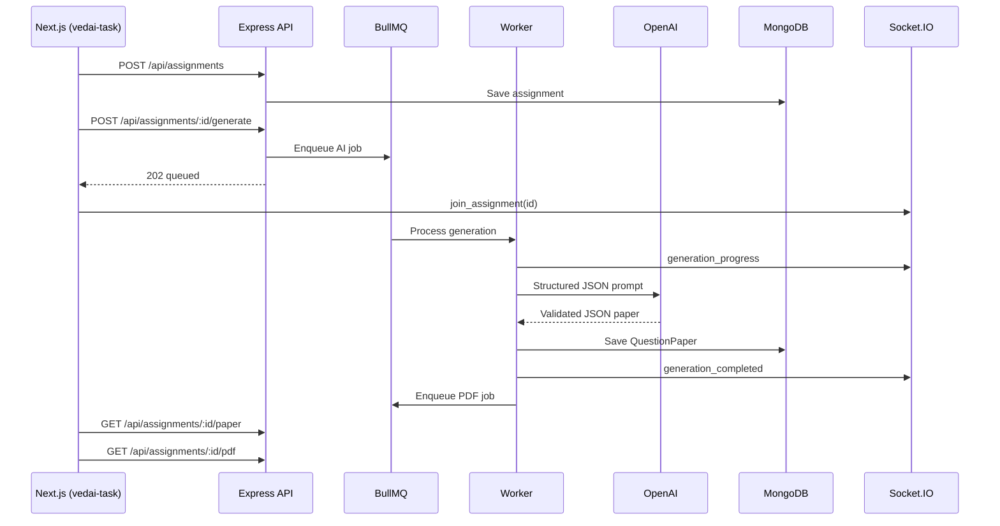
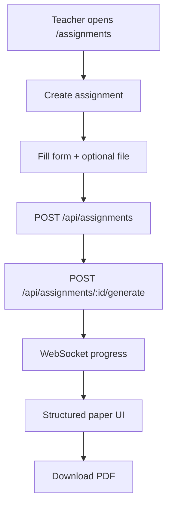

# VedaAI  AI Assessment Creator

AI-powered assignment and question-paper generator for teachers. Built from the [VedaAI Figma designs](https://www.figma.com/design/nB2HMm1BhTpmHcHrmEslGB/VedaAI---Hiring-Assignment?node-id=0-1&p=f&t=tUGLkRYU2B1jXhCg-0).

## Live Demo

- [Deployed frontend](https://ai-assignment-generator-nextjs-type-eight.vercel.app/)

## Assignment reference

- [VedaAI Full Stack Engineering Assignment](https://www.notion.so/VedaAI-Full-Stack-Engineering-Assignment-32748238bd318068a430e90272b485d7)
- [Figma  original](https://www.figma.com/design/nB2HMm1BhTpmHcHrmEslGB/VedaAI---Hiring-Assignment?node-id=0-1&p=f&t=tUGLkRYU2B1jXhCg-0)
- [Figma  duplicated copy](https://www.figma.com/design/CSiaWfh0xUNaag43sKP03b/VedaAI---Hiring-Assignment--Copy-?node-id=0-1&t=N5chhirCO1hRAUEq-0)

---

# Overview

Teachers can:

- Create assignments with question types, marks, and due dates
- Upload optional reference files (PDF / text)
- Generate structured question papers via AI (not raw LLM output)
- See real-time generation progress (WebSocket)
- View and download formatted exam papers (PDF)

---

# Project structure

```txt
Vedai-assignment/
├── vedai-task/          # Main Next.js frontend (App Router)
├── backend/             # Express API + workers (single-file server)
├── client/              # Alternate / earlier Next.js UI
└── README.md
```

| Folder | Role |
|--------|------|
| `vedai-task/` | Primary UI  create, generating, output pages |
| `backend/` | REST API, MongoDB, Redis, BullMQ, Socket.IO, OpenAI, PDF |
| `client/` | Additional Next.js frontend variant |

---

# Architecture overview

## Full-stack flow



## High-level product flow



---

# Local setup (full stack)

## Prerequisites

- Node.js 18+
- **Docker Desktop** (recommended) — runs Redis + MongoDB without `brew install`
- Or install Redis/MongoDB manually / use Atlas + Upstash in the cloud

---

### Option A — Redis & MongoDB with Docker (recommended)

**Step 1 — Install Docker Desktop**

1. Download: [https://www.docker.com/products/docker-desktop/](https://www.docker.com/products/docker-desktop/)
2. Install and open **Docker Desktop**
3. Wait until it says **Docker is running** (whale icon in the menu bar)

**Step 2 — Start Redis and MongoDB**

From the **repo root** (`Vedai-assignment/`):

```bash
cd /path/to/Vedai-assignment
docker compose up -d
```

Check containers are healthy:

```bash
docker compose ps
```

You should see `vedaai-redis` and `vedaai-mongodb` with status **running**.

**Step 3 — Backend `.env`**

```bash
cd backend
cp .env.example .env
```

These values already match Docker (no change needed if you use defaults):

```env
MONGODB_URI=mongodb://127.0.0.1:27017/vedaai
REDIS_URL=redis://127.0.0.1:6379
```

**Step 4 — Install and run the API**

```bash
npm install
npm run dev
```

**Step 5 — Verify**

```bash
curl http://localhost:5000/api/health
```

Expect `"mongo": true` and `"redis": true`.

**Step 6 — Run the frontend** (separate terminal)

```bash
cd vedai-task
cp .env.local.example .env.local
npm install
npm run dev
```

Open `http://localhost:3000`.

**Useful Docker commands**

| Command | What it does |
|---------|----------------|
| `docker compose up -d` | Start Redis + MongoDB in background |
| `docker compose down` | Stop containers (keeps data volumes) |
| `docker compose down -v` | Stop and **delete** stored DB data |
| `docker compose logs -f redis` | Watch Redis logs |
| `docker compose logs -f mongodb` | Watch MongoDB logs |

---

### Option B — Install with Homebrew (no Docker)

```bash
brew install redis
brew services start redis

brew tap mongodb/brew && brew install mongodb-community
brew services start mongodb-community
```

Then use the same `backend/.env` URLs as above.

---

## Backend setup

```bash
cd backend
cp .env.example .env
npm install
npm run dev
```

- API: `http://localhost:5000`
- Health: `GET http://localhost:5000/api/health`

See `backend/.env.example` for all variables. **`OPENAI_API_KEY`** is optional  without it, the server returns a mock structured paper for local demos.

---

## Frontend setup (`vedai-task/`)

```bash
cd vedai-task
cp .env.local.example .env.local
npm install
npm run dev
```

`.env.local`:

```env
NEXT_PUBLIC_API_URL=http://localhost:5000/api
NEXT_PUBLIC_SOCKET_URL=http://localhost:5000
```

Open: `http://localhost:3000`

---

## Alternate frontend (`client/`)

```bash
cd client
pnpm install   # or npm install
pnpm dev
```

---

# Frontend features & structure

## Features implemented

### Assignment dashboard

- Assignment listing UI
- Search and filter UI
- Create assignment CTA

### Assignment creation

- Title and due date
- Dynamic question types (add / remove rows)
- Per-type question count and marks
- Total questions and marks summary
- Additional instructions
- Optional file upload (PDF / text)
- Form validation
- Submits to backend API and starts generation

### Generating screen

- Progress bar driven by WebSocket events
- Step indicators (analyzing, drafting, balancing, compiling)
- Redirects to output on `generation_completed`

### Generated output

- Exam-style layout (student info lines, sections, questions)
- Difficulty badges (Easy / Moderate / Challenging)
- Marks per question
- Regenerate and PDF download (API-backed)

## Frontend project structure

```txt
vedai-task/
├── app/
│   ├── assignments/
│   │   ├── create/
│   │   ├── generating/
│   │   ├── output/
│   │   └── page.tsx
│   └── layout/
├── components/
├── hooks/
│   └── useAssignmentSocket.ts
├── lib/
│   └── api.ts
├── store/
│   └── assignmentStore.ts
└── app/data/mockAssignments.tsx
```

## Frontend integration

| File | Purpose |
|------|---------|
| `lib/api.ts` | HTTP client  create, list, generate, fetch paper, PDF URL |
| `hooks/useAssignmentSocket.ts` | Socket.IO  progress, completed, failed |
| `store/assignmentStore.ts` | Zustand  draft form, `activeAssignmentId`, generated paper |

## Design decisions

- App Router with reusable UI components
- Mobile-responsive layout aligned with Figma
- Structured paper rendering (never raw LLM text on screen)
- Clean typography and section hierarchy

---

# Backend features & architecture

Production backend lives in a **single file**: `backend/src/server.ts` (Express + workers in one process). Deeper notes: `backend/BACKEND.md`.

## What the backend does

| Capability | Implementation |
|------------|----------------|
| Assignment CRUD | MongoDB `Assignment` model |
| AI generation queue | BullMQ `AI_GENERATION_QUEUE` |
| PDF generation queue | BullMQ `PDF_GENERATION_QUEUE` |
| Structured AI output | Zod-validated JSON (sections → questions) |
| Real-time updates | Socket.IO rooms `assignment:{id}` |
| Caching | Redis (list, assignment, paper) |
| File upload | Multer → `./uploads` |
| PDF download | pdf-lib → `./generated-pdfs` |
| Security / ops | Helmet, CORS, compression, rate limit (120/min) |

## Backend project structure

```txt
backend/
├── src/
│   └── server.ts       # Full server (API, models, queues, workers, sockets)
├── .env.example
├── package.json
├── tsconfig.json
└── BACKEND.md          # Extended API & deployment notes
```

## Internal sections (`server.ts`)

| Section | Purpose |
|---------|---------|
| ENV & config | Port, MongoDB, Redis, OpenAI, upload paths |
| Zod schemas | Request body + AI response validation |
| Mongoose models | `Assignment`, `QuestionPaper` |
| Redis | Cache keys + BullMQ connection |
| BullMQ | AI and PDF workers with retries |
| OpenAI service | Prompt builder, JSON parse, mock fallback |
| PDF service | Exam layout via pdf-lib |
| Socket.IO | `generation_*` events per assignment |
| Express routes | REST API + multer + error handler |

## MongoDB models

**Assignment**

- `title`, `dueDate`, `instructions`, `additionalInfo`
- `questionTypes[]` — `{ type, count, marks }`
- `totalQuestions`, `totalMarks`
- `status` — `draft` \| `queued` \| `generating` \| `completed` \| `failed`
- `progress`, `progressMessage`, `errorMessage`
- `uploadedFilePath`, `uploadedText`
- `questionPaperId`

**QuestionPaper**

- `assignmentId`
- `sections[]` — `{ title, instruction, heading, questions[] }`
- `questions[]` — `{ question, difficulty, marks }`
- `metadata` — subject, class, time, max marks, notes
- `pdfPath`

## BullMQ queues

| Queue | Job | Result |
|-------|-----|--------|
| `AI_GENERATION_QUEUE` | Build prompt → OpenAI → validate JSON → save paper | Socket progress + DB update |
| `PDF_GENERATION_QUEUE` | Render exam PDF | `GET /api/assignments/:id/pdf` |

Retries: 3 attempts, exponential backoff.

## WebSocket events

Connect to `NEXT_PUBLIC_SOCKET_URL`, then:

```ts
socket.emit("join_assignment", assignmentId);

socket.on("generation_started", ...);
socket.on("generation_progress", ...);  // { progress, message, status }
socket.on("generation_completed", ...);
socket.on("generation_failed", ...);
```

## AI response shape (validated, not rendered raw)

```json
{
  "sections": [
    {
      "title": "Section A",
      "instruction": "Attempt all questions",
      "heading": "Short Answer Questions",
      "questions": [
        { "question": "...", "difficulty": "medium", "marks": 5 }
      ]
    }
  ],
  "metadata": {
    "subject": "Science",
    "className": "Grade 8",
    "timeAllowed": "45 minutes",
    "maxMarks": 50,
    "notes": "All questions are compulsory."
  }
}
```

API `GET /paper` maps this to the frontend shape (`text`, `instructions`, normalized difficulty labels).

---

# REST API summary

Base URL: `http://localhost:5000/api` (or your deployed host).

| Method | Path | Code |
|--------|------|------|
| POST | `/api/assignments` | 201 |
| GET | `/api/assignments` | 200 |
| GET | `/api/assignments/:id` | 200 |
| POST | `/api/assignments/:id/generate` | 202 |
| GET | `/api/assignments/:id/status` | 200 |
| GET | `/api/assignments/:id/paper` | 200 |
| GET | `/api/assignments/:id/pdf` | 200 (file stream) |

Additional: `GET /api/health`  server, MongoDB, Redis, OpenAI status.

---

## API details

### `POST /api/assignments`  Create assignment

**Content-Type:** `multipart/form-data`

| Field | Type | Required |
|-------|------|----------|
| `title` | string | yes |
| `dueDate` | string | yes |
| `questionTypes` | JSON string | yes |
| `additionalInfo` | string | no |
| `instructions` | string | no |
| `file` | PDF / txt | no |

**Example `questionTypes`:**

```json
[
  { "type": "Multiple Choice Questions", "count": 4, "marks": 1 },
  { "type": "Short Questions", "count": 3, "marks": 2 }
]
```

**Response `201`:**

```json
{
  "success": true,
  "data": {
    "id": "665f1a2b3c4d5e6f7a8b9c0d",
    "title": "Quiz on Electricity",
    "dueDate": "21-06-2025",
    "status": "draft",
    "totalQuestions": 7,
    "totalMarks": 10,
    "progress": 0,
    "questionPaperId": null
  }
}
```

---

### `GET /api/assignments` List assignments

**Response `200`:**

```json
{
  "success": true,
  "data": [
    {
      "id": "665f1a2b3c4d5e6f7a8b9c0d",
      "title": "Quiz on Electricity",
      "dueDate": "21-06-2025",
      "assignedOn": "20-06-2025",
      "status": "completed"
    }
  ]
}
```

---

### `GET /api/assignments/:id`  Get one assignment

**Response `200`:** Same shape as create response, includes `progress`, `progressMessage`, `status`.

**Response `404`:** Assignment not found.

---

### `POST /api/assignments/:id/generate`  Start AI generation

**Response `202`:**

```json
{
  "success": true,
  "message": "Generation queued",
  "data": {
    "assignment": { "id": "...", "status": "queued" },
    "jobId": "1"
  }
}
```

**Response `409`:** Generation already in progress.

---

### `GET /api/assignments/:id/status`  Poll generation status

**Response `200`:**

```json
{
  "success": true,
  "data": {
    "id": "665f1a2b3c4d5e6f7a8b9c0d",
    "status": "generating",
    "progress": 35,
    "message": "Drafting questions",
    "questionPaperId": null
  }
}
```

---

### `GET /api/assignments/:id/paper`  Structured question paper

**Response `200`:**

```json
{
  "success": true,
  "data": {
    "school": "Science",
    "subject": "Science",
    "className": "Grade 8",
    "timeAllowed": "45 minutes",
    "maxMarks": 50,
    "notes": "All questions are compulsory.",
    "sections": [
      {
        "id": "A",
        "title": "Section A",
        "heading": "Short Questions",
        "instructions": "Attempt all questions",
        "questions": [
          {
            "text": "Define electroplating.",
            "difficulty": "Easy",
            "marks": 2
          }
        ]
      }
    ],
    "pdfAvailable": true
  }
}
```

**Response `404`:** Paper not generated yet.

---

### `GET /api/assignments/:id/pdf` Download PDF

**Response `200`:** `application/pdf` file stream.

**Response `404`:** PDF not ready (wait a few seconds after generation completes).

---

## Environment variables

### Backend (`backend/.env`)

```env
PORT=5000
NODE_ENV=development
CORS_ORIGIN=http://localhost:3000

MONGODB_URI=mongodb://127.0.0.1:27017/vedaai
REDIS_URL=redis://127.0.0.1:6379

OPENAI_API_KEY=sk-your-key-here
OPENAI_MODEL=gpt-4o-mini

UPLOAD_DIR=./uploads
PDF_DIR=./generated-pdfs
CACHE_TTL_SEC=300
```

### Frontend (`vedai-task/.env.local`)

```env
NEXT_PUBLIC_API_URL=http://localhost:5000/api
NEXT_PUBLIC_SOCKET_URL=http://localhost:5000
```

---

# Deployment

| Component | Suggested platform |
|-----------|-------------------|
| Frontend (`vedai-task`) | [Vercel](https://vercel.com) |
| Backend API + workers | [Railway](https://railway.app) or [Render](https://render.com) |
| MongoDB | [MongoDB Atlas](https://www.mongodb.com/atlas) |
| Redis | [Upstash](https://upstash.com) or Railway Redis |

**Backend deploy commands:**

```bash
npm run build
npm start
```

Set all variables from `backend/.env.example` on the host. Point frontend env vars to the deployed API and Socket URL.

---

# Development workflow

1. Start **Redis** and **MongoDB**
2. `cd backend && npm run dev`  API on port **5000**, workers run in-process
3. `cd vedai-task && npm run dev`  UI on port **3000**
4. Create assignment → auto-triggers generate → watch `/assignments/generating`
5. On complete → `/assignments/output` loads paper from API
6. Download PDF when `pdfAvailable` is true

---

# Future improvements

- Teacher authentication (JWT / sessions)
- Assignment list wired fully to `GET /api/assignments` (partially ready on API)
- Cloud file storage (S3 / Cloudinary) instead of local disk
- Answer key generation in AI pipeline
- Rich text / LaTeX question editor

---

# Challenges faced

- Migrating generated UI code to Next.js App Router
- Preserving Figma-aligned responsive layout
- Parsing and validating structured AI JSON (never showing raw LLM output)
- Coordinating BullMQ jobs with Socket.IO progress for a smooth UX

---

# Submission

- GitHub repository with frontend + backend
- README architecture and setup (this file)
- Deployed frontend link (Vercel)
- Backend deployable to Railway/Render with Atlas + Redis

---

# Tech stack

## Frontend (`vedai-task/`)

- Next.js 15+ (App Router)
- TypeScript
- Zustand (state)
- Tailwind CSS
- Socket.IO Client
- Lucide Icons

## Backend (`backend/`)

- Node.js + Express (TypeScript)
- MongoDB + Mongoose
- Redis (cache + BullMQ)
- BullMQ (AI + PDF job queues)
- Socket.IO (real-time updates)
- OpenAI (structured JSON generation)
- pdf-lib + pdf-parse (PDF export & text extraction)
- Zod (validation)
- Multer (file uploads)

---


# Author

Made with love by :Kavya Kapoor :) 
