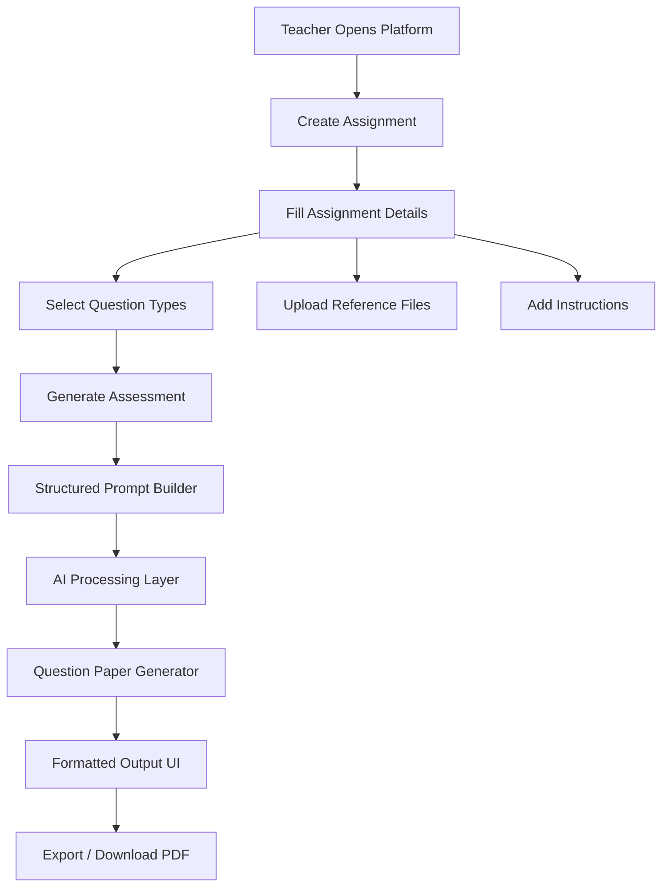
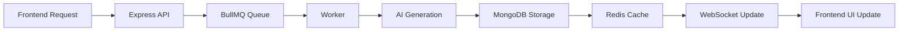

<!-- 
[Link-of-the-crazzy-assignment](https://www.notion.so/VedaAI-Full-Stack-Engineering-Assignment-32748238bd318068a430e90272b485d7)
# Vedai Assignment Generator (Next.js)
[figma-file-link](https://www.figma.com/design/nB2HMm1BhTpmHcHrmEslGB/VedaAI---Hiring-Assignment?node-id=0-1&p=f&t=tUGLkRYU2B1jXhCg-0)

[my-figma-duplicated-copy-file](https://www.figma.com/design/CSiaWfh0xUNaag43sKP03b/VedaAI---Hiring-Assignment--Copy-?node-id=0-1&t=N5chhirCO1hRAUEq-0)

This repo contains the **Assignment Generator UI** (Next.js + TypeScript) for creating assignments and generating papers.


---

## Project Structure

- `client/`  Next.js (frontend)
  - `app/assignments/*`assignment list, create flow, and generated paper views
  - `app/layout.tsx`  root layout


---

## Prerequisites

- Node.js 18+
- pnpm (recommended) or npm

---

## Local Setup & Run (Frontend)

### 1) Install dependencies

```bash
cd Vedai-assignment/client
pnpm install
```

(If you prefer npm)

```bash
cd Vedai-assignment/client
npm install
```

### 2) Run the dev server

```bash
pnpm dev
```

(or)

```bash
npm run dev
```

### 3) Open in browser

Visit:
- `http://localhost:3000`

---

## Deployment

### Vercel

The project is configured for Vercel builds from `client/`.


---

## Architecture Overview

High-level flow (UI-only):

1. User navigates to **/assignments**
2. User opens **/assignments/create**
3. User fills assignment inputs (question type, topic, etc.)
4. The UI requests generation
5. Generated output is shown under **/assignments/output** (and related views) -->


# VedaAI  Assignment Generator

AI-powered Assignment & Question Paper Generator built using **Next.js + TypeScript** inspired by the provided Figma designs.

## Live Demo

- [Deployed Link](https://ai-assignment-generator-nextjs-type-eight.vercel.app/): 


---
## Link-> https://ai-assignment-generator-nextjs-type-eight.vercel.app/

# Assignment Reference

- [VedaAI Full Stack Engineering Assignment](https://www.notion.so/VedaAI-Full-Stack-Engineering-Assignment-32748238bd318068a430e90272b485d7)

---

# Figma References

- [Original Figma Design](https://www.figma.com/design/nB2HMm1BhTpmHcHrmEslGB/VedaAI---Hiring-Assignment?node-id=0-1&p=f&t=tUGLkRYU2B1jXhCg-0)

- [My Duplicated Figma Copy](https://www.figma.com/design/CSiaWfh0xUNaag43sKP03b/VedaAI---Hiring-Assignment--Copy-?node-id=0-1&t=N5chhirCO1hRAUEq-0)

---

# Overview

This project is an AI-based Assessment Creator platform where teachers can:

- Create assignments
- Configure question types
- Define marks and difficulty
- Generate structured question papers
- View generated outputs in a clean exam-paper layout

The frontend was implemented based on the provided Figma UI with focus on:

- Pixel-perfect implementation
- Responsive layout
- Clean component architecture
- Modern UI/UX
- Scalable folder structure

---

# Architecture Overview

## High-Level Flow



---

# Planned Backend Workflow



---


---

# Local Setup

## 1. Clone Repository

```bash
git clone https://github.com/KavyaKapoor420/ai-assignment-generator-Nextjs-typescript.git
```

---

## 2. Navigate to Frontend

```bash
cd ai-assignment-generator-Nextjs-typescript/client
```

---

## 3. Install Dependencies

Using pnpm:

```bash
pnpm install
```

or npm:

```bash
npm install
```

---

## 4. Run Development Server

```bash
pnpm dev
```

or

```bash
npm run dev
```

---

## 5. Open Browser

```txt
http://localhost:3000
```

---


# Features Implemented

## Assignment Dashboard

- Assignment listing UI
- Search assignments
- Filter UI
- Create Assignment CTA

---

## Assignment Creation

- Due date input
- Dynamic question sections
- Add/remove question types
- Marks and question counters
- Additional instructions
- File upload UI
- Responsive form layout

---

## Generated Output UI

- Structured question paper layout
- Student information section
- Question grouping
- Difficulty indicators
- Marks display
- Exam-style formatting

---

# Tech Stack

## Frontend

- Next.js 15
- TypeScript
- App Router
- Redux Toolkit
- Tailwind CSS
- Lucide Icons

---

## Planned Backend Architecture

- Node.js
- Express.js
- MongoDB
- Redis
- BullMQ
- WebSockets (Socket.IO)

---

## AI Layer

Planned integration support for:

- OpenAI GPT
- Claude
- OSS Models

---

# Project Structure

```txt
client/
│
├── app/
│   ├── assignments/
│   │   ├── create/
│   │   ├── output/
│   │   └── page.tsx
│   │
│   ├── layout.tsx
│   └── page.tsx
│
├── components/
│   ├── layout/
│   ├── ui/
│   └── veda/
│
├── lib/
├── public/
├── store/
└── styles/
```


# Design & UI Decisions

- Used reusable component architecture
- Followed App Router structure
- Maintained scalable folder separation
- Focused on exam-paper readability
- Mobile responsive layout
- Clean typography hierarchy
- Modern rounded UI matching Figma

---

# State Management

Redux Toolkit was used/planned for:

- Assignment state
- Form state
- Generated paper state
- Async API handling

---

# Future Improvements

- AI integration
- PDF export
- Real-time generation updates
- Assignment history
- Teacher authentication
- Better caching
- WebSocket live status
- Rich text question editor

---

# Challenges Faced

- Migrating generated Vite/TanStack code to Next.js App Router
- Preserving pixel-perfect UI from Figma
- Managing scalable component structure
- Handling responsive layout consistency

---

# Submission

## GitHub Repository

- Clean architecture
- Modular components
- Reusable UI structure
- Responsive design

## Deployment

- Hosted on Vercel

---

# Author

Kavya Kapoor