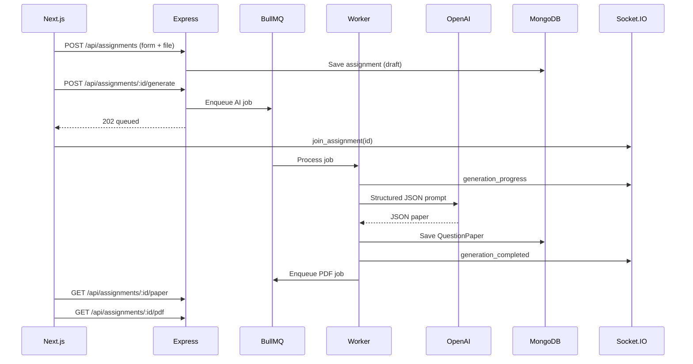

# VedaAI Backend (Single-File Architecture)

All production logic lives in **`src/server.ts`** — one file, no MVC folders.

## What's inside `server.ts`

| Section | Purpose |
|--------|---------|
| ENV & dirs | Port, MongoDB, Redis, OpenAI, upload/PDF paths |
| Zod schemas | Request + AI response validation |
| Mongoose models | `Assignment`, `QuestionPaper` |
| Redis | Cache + BullMQ connection |
| BullMQ | `AI_GENERATION_QUEUE`, `PDF_GENERATION_QUEUE` + workers |
| OpenAI | Prompt builder, JSON parse, mock fallback |
| pdf-lib | Exam PDF generation |
| Socket.IO | Room `assignment:{id}`, progress events |
| Express | REST API, multer uploads, rate limit, errors |

## Prerequisites

- Node.js 18+
- MongoDB running locally or Atlas URI
- Redis running locally or cloud URI

```bash
# macOS
brew install redis
brew services start redis

# MongoDB (or use Atlas)
brew tap mongodb/brew && brew install mongodb-community
brew services start mongodb-community
```

## Setup

```bash
cd backend
cp .env.example .env
# Edit .env — add OPENAI_API_KEY for real AI (optional: mock works without it)

npm install
npm run dev
```

Server: `http://localhost:5000`  
Health: `GET http://localhost:5000/api/health`

## Frontend env (`vedai-task/.env.local`)

```env
NEXT_PUBLIC_API_URL=http://localhost:5000/api
NEXT_PUBLIC_SOCKET_URL=http://localhost:5000
```

```bash
cd ../vedai-task
npm run dev
```

## End-to-end flow



## REST API

### `POST /api/assignments`

`multipart/form-data`:

| Field | Type | Required |
|-------|------|----------|
| title | string | yes |
| dueDate | string | yes |
| questionTypes | JSON string | yes |
| additionalInfo | string | no |
| instructions | string | no |
| file | PDF/txt | no |

**Response `201`:**

```json
{
  "success": true,
  "data": {
    "id": "665f...",
    "title": "Quiz on Electricity",
    "status": "draft",
    "totalQuestions": 17,
    "totalMarks": 45
  }
}
```

### `GET /api/assignments`

List assignments (Redis-cached 60s).

### `GET /api/assignments/:id`

Single assignment + status.

### `POST /api/assignments/:id/generate`

Starts AI job. **202** when queued, **409** if already running.

### `GET /api/assignments/:id/status`

```json
{
  "success": true,
  "data": {
    "status": "generating",
    "progress": 35,
    "message": "Drafting questions"
  }
}
```

### `GET /api/assignments/:id/paper`

Structured paper for output page (not raw LLM text).

### `GET /api/assignments/:id/pdf`

Downloads PDF after background PDF job completes.

## Socket events

Connect: `io(NEXT_PUBLIC_SOCKET_URL)`

```ts
socket.emit("join_assignment", assignmentId);
socket.on("generation_started", ...);
socket.on("generation_progress", ...);
socket.on("generation_completed", ...);
socket.on("generation_failed", ...);
```

Frontend hook: `vedai-task/hooks/useAssignmentSocket.ts`  
API client: `vedai-task/lib/api.ts`

## File storage

- **Local (default):** `./uploads`, `./generated-pdfs`
- **Production:** swap multer to S3/Cloudinary; store URLs on `Assignment`

## PDF approach

**pdf-lib** (chosen): fast, no headless Chrome, good for exam layouts.  
**Puppeteer:** best pixel-perfect HTML→PDF, heavier on Railway/Render.  
**react-pdf:** better for React component PDFs, not ideal in Express worker.

## Deployment

| Service | Platform |
|---------|----------|
| Frontend | Vercel (`vedai-task`) |
| API + Workers | Railway / Render — run `npm run build && npm start` |
| MongoDB | Atlas |
| Redis | Upstash / Railway Redis |

Set env vars from `.env.example` on the host.  
**Important:** Workers run in the same process as the API in this single-file setup (fine for assignment scale).

## Bonus features included

- Redis caching (assignments list, paper, status)
- Rate limiting (120 req/min)
- Zod validation (body + AI output)
- Helmet + compression + CORS
- Exponential backoff on BullMQ (3 attempts)
- Structured logging
- Mock AI when `OPENAI_API_KEY` is empty

## Redux (optional)

This repo uses **Zustand** (`store/assignmentStore.ts`). For Redux Toolkit, mirror `lib/api.ts` calls in `createAsyncThunk` — same endpoints as documented above.
